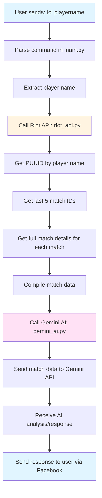

# LOL AI Chat Integration Plan

## Overview
Integrate an AI chat feature for League of Legends (LOL) into the Facebook chat bot. The bot will fetch the last 5 match data for a player from Riot Games API and analyze it using Google Gemini AI.

## Requirements
- **Command Format**: `lol <playername>`
- **Region**: Vietnam (VN)
- **API Keys**: Stored directly in code
- **Match Data**: Full match data including all participants and timeline

## Architecture



## Module Structure

### 1. riot_api.py - Riot Games API Integration

**Purpose**: Handle all communications with Riot Games API

**API Endpoints**:
- `https://vn2.api.riotgames.com/lol/summoner/v4/summoners/by-name/{name}` - Get summoner PUUID
- `https://sea.api.riotgames.com/lol/match/v5/matches/by-puuid/{puuid}/ids?start=0&count=5` - Get last 5 match IDs
- `https://sea.api.riotgames.com/lol/match/v5/matches/{matchId}` - Get full match details

**Functions**:
```python
class RiotAPI:
    def __init__(self, api_key):
        self.api_key = api_key
        self.base_url_vn = "https://vn2.api.riotgames.com"
        self.base_url_sea = "https://sea.api.riotgames.com"
    
    def get_puuid_by_name(self, summoner_name):
        """Get player PUUID by summoner name"""
        
    def get_match_ids_by_puuid(self, puuid, count=5):
        """Get last N match IDs by PUUID"""
        
    def get_match_details(self, match_id):
        """Get full match details including participants and timeline"""
        
    def get_player_matches(self, summoner_name, count=5):
        """Convenience method to get all match data for a player"""
```

**Error Handling**:
- Player not found (404)
- Rate limit exceeded (429)
- Invalid API key (403)
- Network errors

### 2. gemini_ai.py - Gemini API Integration

**Purpose**: Handle all communications with Google Gemini AI

**Functions**:
```python
class GeminiAI:
    def __init__(self, api_key):
        self.api_key = api_key
        self.model = None
        
    def initialize(self):
        """Initialize Gemini client"""
        
    def analyze_lol_matches(self, match_data, player_name):
        """Send match data to Gemini and get AI analysis"""
        # Prompt template:
        # "Analyze the last 5 League of Legends matches for player {player_name}.
        # Here is the full match data including all participants and timeline:
        # {match_data}
        # 
        # Please provide:
        # 1. Overall performance summary
        # 2. Key strengths and weaknesses
        # 3. Suggestions for improvement
        # 4. Notable patterns across matches"
```

**Prompt Design**:
- Clear context about the task
- Structured output requirements
- Vietnamese language response (since user is using Vietnamese)

**Error Handling**:
- Invalid API key
- Quota exceeded
- Network errors

### 3. main.py - Integration Updates

**Changes to receiveCommandAndSend()**:

```python
def receiveCommandAndSend(self):
    if (self.dataFB["FacebookID"] != self.userID):
        match self.commandPlugins.lower():
            # ... existing cases ...
            case _ if self.commandPlugins.lower().startswith("lol "):
                # Extract player name from command
                player_name = self.commandPlugins[4:].strip()
                if not player_name:
                    self.bodySend = "Vui lòng nhập tên người chơi. Ví dụ: /lol playername"
                else:
                    try:
                        # Fetch match data
                        riot_api = RiotAPI(RIOT_API_KEY)
                        match_data = riot_api.get_player_matches(player_name, count=5)
                        
                        # Analyze with AI
                        gemini = GeminiAI(GEMINI_API_KEY)
                        gemini.initialize()
                        self.bodySend = gemini.analyze_lol_matches(match_data, player_name)
                    except Exception as e:
                        self.bodySend = f"Lỗi: {str(e)}"
            case __:
                self.bodySend = None
        # ... rest of function ...
```

## Dependencies

Add to `requirements.txt`:
```
requests>=2.31.0
paho-mqtt>=1.6.1
attrs>=23.1.0
google-generativeai>=0.3.0
```

## API Key Configuration

Place at the top of `main.py`:
```python
# API Keys
RIOT_API_KEY = "your_riot_api_key_here"
GEMINI_API_KEY = "your_gemini_api_key_here"
```

## Error Handling Strategy

1. **Player Not Found**: Return friendly message to user
2. **Rate Limit**: Inform user to try again later
3. **API Errors**: Log error and return generic error message
4. **Empty Results**: Handle case where player has no recent matches

## Testing Plan

1. Test with known valid player name
2. Test with invalid player name
3. Test with player who has no recent matches
4. Test API error scenarios
5. Verify AI response quality

## Future Enhancements (Optional)

- Cache match data to reduce API calls
- Add more commands (e.g., `/lol stats`, `/lol rank`)
- Support multiple regions
- Add emoji reactions based on win/loss
- Support Vietnamese summoner names with special characters
