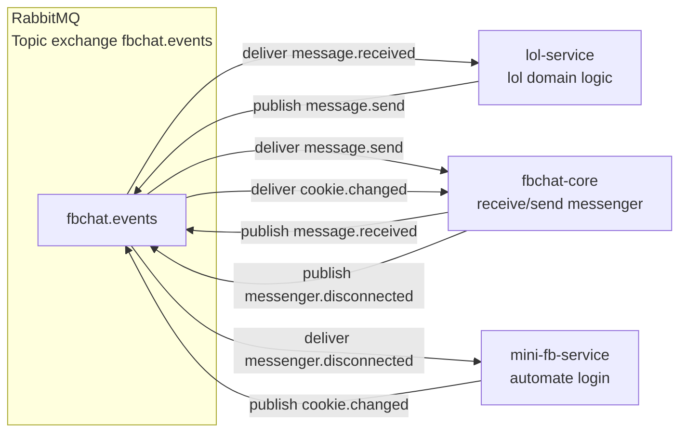

# Microservices refactor plan (monorepo + docker-compose)

## Goals

- Split the current repo into 3 runnable services in the same monorepo:
  - `fbchat-core`: Facebook messenger receive/send + publish events.
  - `lol-service`: LoL-related features (currently mixed into bot commands) extracted into its own service.
  - `mini-fb-service`: Python service that automates Facebook login (Puppeteer/Selenium, undetected) and publishes `cookie.changed` events for `fbchat-core`.
- Use RabbitMQ as the event bus.
- Keep Pydantic models for runtime validation in Python services, but **export versioned JSON Schemas** under `/contracts` for cross-service compatibility.
- Design to be extensible (new services and events later).

## Current state (observed)

- `src/` is a single Python codebase.
- RabbitMQ is already present:
  - Event models: [`src/events.py`](../src/events.py)
  - RabbitMQ client: [`src/rabbitmq_client.py`](../src/rabbitmq_client.py)
  - Publishers/subscribers: [`src/publishers/message_publisher.py`](../src/publishers/message_publisher.py), [`src/subscribers/cookie_change_subscriber.py`](../src/subscribers/cookie_change_subscriber.py)
- `docker-compose` currently runs `rabbitmq` and one `fbchat-bot` container: [`docker-compose.yml`](../docker-compose.yml)

## Target monorepo layout

Proposed structure (new top-level directories):

- `services/`
  - `fbchat-core/`
    - `src/fbchat_core/` (python package)
    - `Dockerfile`
    - `requirements.txt`
    - `README.md`
  - `lol-service/`
    - `src/lol_service/`
    - `Dockerfile`
    - `requirements.txt`
    - `README.md`
  - `mini-fb-service/`
    - `src/mini_fb_service/`
    - `Dockerfile`
    - `requirements.txt`
    - `README.md`
- `contracts/`
  - `v1/`
    - `message.received.schema.json`
    - `message.send.schema.json`
    - `cookie.changed.schema.json`
    - `match.ended.schema.json`
    - `messenger.disconnected.schema.json`
    - `README.md`
- `infra/`
  - `docker-compose.yml` (new canonical compose)
  - `docker-compose.override.yml` (optional local dev override)
- `scripts/`
  - `export_schemas.py` (generate `/contracts/v1/*.json` from Pydantic)

Notes:
- Keep the current root-level files during migration, but the end state should prefer per-service dockerfiles/requirements.
- `services/*/src/<pkg>/` ensures import sanity and avoids the current `__foo.py` flat-module approach.

## Service boundaries

### `fbchat-core`

Owns:
- Facebook session/cookie usage (consumes cookie updates).
- Messenger MQTT long-poll/listen.
- Publish events:
  - `message.received`
  - `messenger.disconnected`
- Consume commands/events:
  - `message.send` to send outbound messages
  - `cookie.changed` to update cookies and reconnect

Out of scope:
- LoL domain logic beyond emitting/consuming events.

### `lol-service`

Owns:
- LoL domain adapters: Riot API, match tracking, rank lookup.
- Consumes `message.received` to detect LoL commands (or, later, a dedicated command routing event).
- Publishes one (or both) of:
  - `message.send` to send responses back
  - `match.ended` (if it is the match tracker) for other services

Migration approach:
- Move code in [`src/riot_api.py`](../src/riot_api.py) and LoL-related commands from [`src/commands/lol_command.py`](../src/commands/lol_command.py) and similar into this service.

### `mini-fb-service`

Owns:
- Automated Facebook login with undetected browser.
- Extract cookie string in a consistent format.
- Publish `cookie.changed` when:
  - cookie refreshed
  - login verified
  - periodic health refresh indicates cookie rotation

Does not handle:
- Messenger listening/sending.

## RabbitMQ: topology and event flow

### Exchange

- Topic exchange: `fbchat.events` (already used via config key `RABBITMQ_EXCHANGE` in [`src/config.py`](../src/config.py)).

### Routing keys (event types)

Keep event_type == routing_key for simplicity:
- `message.received`
- `message.send`
- `cookie.changed`
- `match.ended`
- `messenger.disconnected`

### Queues per service

- `fbchat-core`:
  - consumes: `message.send`, `cookie.changed`
  - publishes: `message.received`, `messenger.disconnected`
- `lol-service`:
  - consumes: `message.received` (and optionally `match.ended` depending on responsibility split)
  - publishes: `message.send` (and optionally `match.ended`)
- `mini-fb-service`:
  - consumes: `messenger.disconnected`
  - publishes: `cookie.changed`

### Delivery guarantees & ops

- Messages persistent (`delivery_mode=2`) is already used.
- Prefetch 1 is already configured.
- Add a dead-letter strategy later (design now, implement incrementally):
  - DLX exchange: `fbchat.dlx`
  - Per-queue DLQ: `<queue>.dlq`

### Correlation

Introduce optional envelope fields in v1 contracts:
- `event_id` (uuid)
- `correlation_id` (uuid, flows across services for a single inbound message)
- `producer` (service name)

Initial step: add these fields as optional to avoid breaking current publishers.

## Contracts (/contracts/v1)

Model mapping:
- Source of truth: Pydantic models in `fbchat-core` (initially reuse [`src/events.py`](../src/events.py) then move).
- Export JSON Schema files (versioned).

Schema rules:
- Fixed `event_type` enum per event.
- `timestamp` ISO8601 string.
- `data` object per event.

Backward compatibility:
- v1 allows unknown extra fields via `additionalProperties: true` initially (relax), then tighten later.

## Docker compose (target)

New compose file under `infra/`:
- `rabbitmq` with management UI.
- `fbchat-core` built from `services/fbchat-core`.
- `lol-service` built from `services/lol-service`.
- `mini-fb-service` built from `services/mini-fb-service`.

Env vars:
- RabbitMQ connection vars per service.
- Service-specific config such as:
  - `FBCHAT_COOKIE` (fbchat-core initial cookie if no mini-fb-service yet)
  - `MINIFB_ACCOUNT`, `MINIFB_PASSWORD` (or token-based auth later)

Local dev:
- mount source volumes for rapid iteration.

## Migration steps (incremental, keep repo working)

1. Scaffold new directories for `services/` and `contracts/`.
2. Move RabbitMQ shared logic to a small internal library pattern:
   - Option A (simpler): duplicate minimal RabbitMQ client in each service.
   - Option B (recommended): create `services/_shared/python/fbchat_shared/` package and vendor it into each service via path dependency.
3. Move event models into `fbchat-core` package, keep import shims temporarily.
4. Introduce schema export script and generate `/contracts/v1` from Pydantic.
5. Extract LoL commands / Riot API into `lol-service`:
   - `lol-service` consumes `message.received` and emits `message.send`.
6. Add `mini-fb-service` skeleton that publishes `cookie.changed` (initially can publish a static cookie for pipeline validation).
7. Update compose to run all 3 services.
8. Remove/retire old root `src/main.py` entrypoint once `fbchat-core` has its own.

## Risks & mitigations

- Import breakage due to current flat module naming (`__messageListenV2.py`, etc):
  - Mitigation: phased move with shim modules and explicit entrypoints.
- Event drift between services:
  - Mitigation: `/contracts/v1` generated in CI; services validate inbound events.
- State/cookie security:
  - Mitigation: pass cookies via env var in dev only; prefer secret store later.

## Mermaid: event flow

## Rollout checklist

- Compose can boot all services.
- `fbchat-core` publishes `message.received` and can consume `message.send`.
- `lol-service` can respond via `message.send`.
- `mini-fb-service` can publish `cookie.changed` and `fbchat-core` reacts.
- `/contracts/v1` schemas generated and committed; CI check ensures they match current Pydantic.
