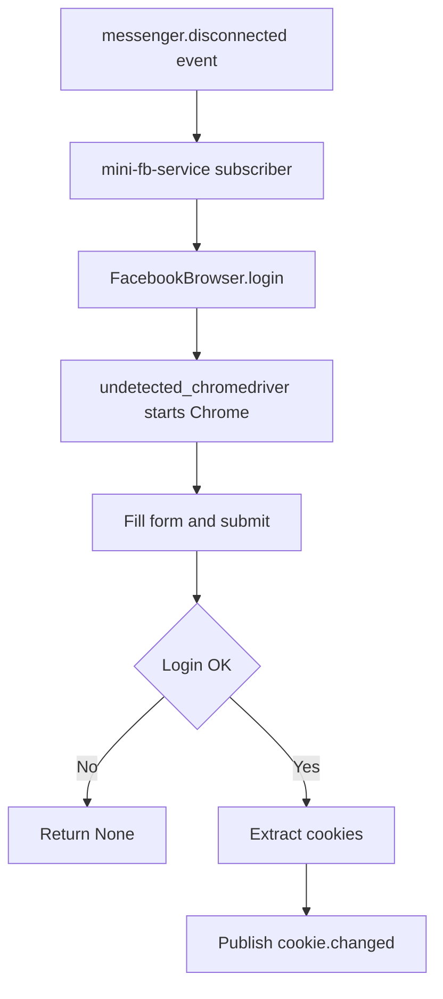

# Plan: Replace Playwright with Selenium + undetected_chromedriver in mini-fb-service

## Goal
Mini-fb-service currently uses Playwright for Facebook login + cookie extraction (see [`services/mini-fb-service/src/mini_fb_service/browser.py`](services/mini-fb-service/src/mini_fb_service/browser.py:1)). This can trigger CAPTCHA. Switch implementation to Selenium + `undetected_chromedriver` (UCD) and simplify to Chromium-only (remove `MINIFB_BROWSER_TYPE`).

## Scope
- Replace Playwright usage in mini-fb-service only.
- Keep the public API of `FacebookBrowser` stable:
  - `start()`, `stop()`, `login(email, password) -> Optional[str]`, `extract_account_id() -> Optional[str]`, context manager.
- Chromium-only:
  - Remove `MINIFB_BROWSER_TYPE` from docs/config.
- Update tests and Docker packaging within `services/mini-fb-service/`.

Non-goals (for now):
- Solving Facebook checkpoint/2FA flows fully (still detect and return `None`).
- Running a remote Selenium Grid.

## Design decisions
1. **Driver**: Use `undetected_chromedriver` to launch Chrome/Chromium with anti-bot mitigations.
2. **Headless**: Controlled by `MINIFB_HEADLESS` (existing behavior). For stealth, prefer headful in production when possible.
3. **Selectors**:
   - Login URL: `https://www.facebook.com/login`
   - Email input: `input[name=email]`
   - Password input: `input[name=pass]`
   - Login button: `button[name=login]`
4. **Post-login checks**:
   - If still on `/login` => fail.
   - If URL contains `checkpoint` => fail (verification required).
5. **Cookie extraction**:
   - Selenium `driver.get_cookies()` and stringify as `name=value; name=value`.
6. **Account ID extraction**:
   - Navigate to `https://www.facebook.com/me`.
   - If URL contains `profile.php?id=...` parse id.
   - Else attempt to read meta `meta[property=al:android:url]` and regex trailing digits.
7. **Tests**:
   - Replace `@patch(sync_playwright)` mocks with `@patch(undetected_chromedriver.Chrome)` (and possibly Selenium `WebDriverWait`).
   - Keep tests unit-level by mocking driver methods.
8. **Docker**:
   - Install Chrome/Chromium and required libs.
   - Ensure matching driver setup (UCD manages chromedriver download).

## Implementation steps (todo list)
- [ ] Update dependencies: remove `playwright` and add `selenium` + `undetected-chromedriver` in [`services/mini-fb-service/requirements.txt`](services/mini-fb-service/requirements.txt:1).
- [ ] Refactor [`services/mini-fb-service/src/mini_fb_service/browser.py`](services/mini-fb-service/src/mini_fb_service/browser.py:1):
  - Remove Playwright imports/types.
  - Implement Selenium+UCD driver lifecycle.
  - Implement `login()` and `extract_account_id()` per design.
- [ ] Update docs: remove `MINIFB_BROWSER_TYPE` from [`services/mini-fb-service/README.md`](services/mini-fb-service/README.md:1).
- [ ] Update container packaging in [`services/mini-fb-service/Dockerfile`](services/mini-fb-service/Dockerfile:1):
  - Install Chrome/Chromium.
  - Add required OS packages for headless/GUI deps.
- [ ] Update tests to mock Selenium driver calls:
  - [`services/mini-fb-service/tests/test_browser.py`](services/mini-fb-service/tests/test_browser.py:1).
- [ ] Run tests for mini-fb-service and fix failures.
- [ ] Add operational notes (captcha/checkpoint limitations) in mini-fb-service README.

## Mermaid overview

