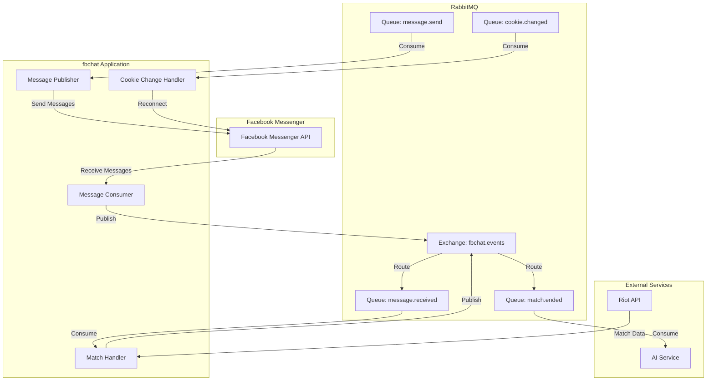

# RabbitMQ Integration Plan

## Overview
This plan outlines the integration of RabbitMQ into the fbchat project for event-driven architecture. RabbitMQ will enable decoupled communication between different components of the system.

## Architecture Overview



## Event Definitions

### 1. OnMessageReceived (Publisher)
**Purpose**: Publish received messages from Facebook to RabbitMQ for downstream processing.

**Event Type**: `message.received`

**Exchange**: `fbchat.events` (topic exchange)

**Routing Key**: `message.received`

**Payload Structure**:
```json
{
  "event_type": "message.received",
  "timestamp": "2024-01-31T12:00:00Z",
  "data": {
    "message_id": "msg_123456",
    "user_id": "100014184491456",
    "sender_id": "100014184491456",
    "body": "Hello world",
    "reply_to_id": "thread_789",
    "type": "thread",
    "attachments": []
  }
}
```

**Integration Point**: [`src/main.py:receiveMessage()`](src/main.py:46) - When a message is received from Facebook

---

### 2. OnMessageSendReceived (Subscriber)
**Purpose**: Consume messages from RabbitMQ to send to Facebook Messenger.

**Event Type**: `message.send`

**Exchange**: `fbchat.events`

**Routing Key**: `message.send`

**Payload Structure**:
```json
{
  "event_type": "message.send",
  "timestamp": "2024-01-31T12:00:00Z",
  "data": {
    "recipient_id": "100014184491456",
    "recipient_type": "user",
    "body": "Reply message",
    "attachment_id": null,
    "attachment_type": null
  }
}
```

**Integration Point**: New consumer service in [`src/__sendMessage.py`](src/__sendMessage.py)

---

### 3. OnCookieChanged (Subscriber)
**Purpose**: Handle cookie change events and re-establish Facebook connections.

**Event Type**: `cookie.changed`

**Exchange**: `fbchat.events`

**Routing Key**: `cookie.changed`

**Payload Structure**:
```json
{
  "event_type": "cookie.changed",
  "timestamp": "2024-01-31T12:00:00Z",
  "data": {
    "account_id": "100014184491456",
    "old_cookie": "...",
    "new_cookie": "...",
    "force_reconnect": true
  }
}
```

**Integration Point**: New cookie management service in [`src/__facebookLoginV2.py`](src/__facebookLoginV2.py)

---

### 4. OnMatchEnd (Publisher)
**Purpose**: Publish match completion events from Riot API to RabbitMQ for downstream processing.

**Event Type**: `match.ended`

**Exchange**: `fbchat.events`

**Routing Key**: `match.ended`

**Payload Structure**:
```json
{
  "event_type": "match.ended",
  "timestamp": "2024-01-31T12:00:00Z",
  "data": {
    "match_id": "VN2_1234567890",
    "puuid": "abc123-def456-ghi789",
    "summoner_name": "PlayerName",
    "game_duration": 1800,
    "win": true,
    "champion": "Ahri",
    "kills": 10,
    "deaths": 3,
    "assists": 8,
    "kda": 6.0
  }
}
```

**Integration Point**: [`src/riot_api.py`](src/riot_api.py) - When match data is retrieved

---

## Implementation Steps

### Step 1: Add RabbitMQ to docker-compose.yml
Add RabbitMQ service to the existing docker-compose configuration.

### Step 2: Update requirements.txt
Add `pika>=1.3.2` for RabbitMQ Python client.

### Step 3: Update config.py
Add RabbitMQ configuration settings:
- `RABBITMQ_HOST`
- `RABBITMQ_PORT`
- `RABBITMQ_USER`
- `RABBITMQ_PASSWORD`
- `RABBITMQ_VHOST`
- `RABBITMQ_EXCHANGE`

### Step 4: Create RabbitMQ Connection Module
Create `src/rabbitmq_client.py` with:
- Connection management
- Reconnection logic
- Publisher base class
- Subscriber base class
- Error handling

### Step 5: Create Event Schemas
Create `src/events.py` with Pydantic models for:
- MessageReceivedEvent
- MessageSendEvent
- CookieChangedEvent
- MatchEndedEvent

### Step 6: Implement OnMessageReceived Publisher
Modify `src/main.py` to publish received messages to RabbitMQ.

### Step 7: Implement OnMessageSendReceived Subscriber
Create consumer service to process message send requests.

### Step 8: Implement OnCookieChanged Subscriber
Create cookie change handler with reconnection logic.

### Step 9: Implement OnMatchEnd Publisher
Modify `src/riot_api.py` to publish match end events.

### Step 10: Add Error Handling
Implement robust error handling for:
- Connection failures
- Message delivery failures
- Queue/Exchange declaration failures

### Step 11: Documentation
Create comprehensive documentation for:
- Setup instructions
- Event specifications
- Troubleshooting guide

## File Structure

```
src/
├── rabbitmq_client.py       # RabbitMQ connection and base classes
├── events.py                # Event schemas/models
├── publishers/
│   ├── __init__.py
│   └── message_publisher.py # Message received publisher
├── subscribers/
│   ├── __init__.py
│   ├── message_send_subscriber.py
│   ├── cookie_change_subscriber.py
│   └── match_end_subscriber.py
└── config.py                # Updated with RabbitMQ settings
```

## Configuration

### Environment Variables (.env.example)
```bash
# RabbitMQ Configuration
RABBITMQ_HOST=rabbitmq
RABBITMQ_PORT=5672
RABBITMQ_USER=guest
RABBITMQ_PASSWORD=guest
RABBITMQ_VHOST=/
RABBITMQ_EXCHANGE=fbchat.events
```

## Exchange and Queue Configuration

| Exchange | Type | Queues | Routing Keys |
|----------|------|--------|--------------|
| fbchat.events | topic | message.received | message.received |
| | | message.send | message.send |
| | | cookie.changed | cookie.changed |
| | | match.ended | match.ended |

## Error Handling Strategy

1. **Connection Failures**: Automatic reconnection with exponential backoff
2. **Message Publish Failures**: Retry with dead-letter queue
3. **Message Processing Failures**: Acknowledge after successful processing, reject on failure
4. **Logging**: Comprehensive logging for all RabbitMQ operations

## Testing Considerations

1. Unit tests for event serialization/deserialization
2. Integration tests for publisher/subscriber communication
3. End-to-end tests for complete message flow
4. Connection failure simulation tests

## Future Extensions

Potential additional events:
- `on.typing.indicator` - User typing indicator
- `on.message.read` - Message read receipt
- `on.friend.request` - Friend request received
- `on.thread.info.changed` - Thread information changed
- `on.user.online` - User online status changed
